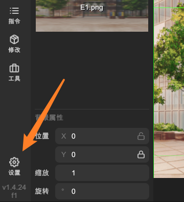
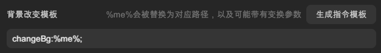
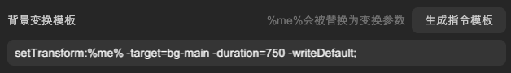

# 配置背景

导入背景后，请打开「设置」窗口，在「常规」页面中配置一些选项。

## 背景改变模板

用于生成 WebGAL 脚本代码的模板。此处填写 `changeBg` 指令。

- 文本框: 编辑 `changeBg` 指令模板。
- 生成指令模板: 一键生成简单的背景指令模板。
  - 会覆盖当前指令模板。

> 如果您对手写 WebGAL 脚本不熟悉，可以使用「生成模板」按钮生成一个简单的模板，然后根据需要进行修改。

当您使用「复制指令 - 切换背景」生成 WebGAL 代码时，L2DW 会将该模板中的占位符替换为实际的参数。

`%me%` 会替换为：

- 背景文件路径。
- `transform`: 背景出场时的变换效果。

例如，假设您在 L2DW 中填写了如下模板:

  changeBg<!--
  -->:<!--
  -->%me%<!--
  -->;

当您执行「复制指令」，L2DW 会将 `%me%` 替换为实际的参数。

  changeBg<!--
  -->:<!--
  -->path/to/image.png<!--
  --> -<!--
  -->transform<!--
  -->=<!--
  -->{"position":{"x":0,"y":0}}<!--
  -->;

## 背景变换模板

用于生成 WebGAL 脚本代码的模板。此处填写 `setTransform` 指令。

- 文本框: 编辑 `setTransform` 指令模板。
- 生成指令模板: 一键生成简单的变换指令模板。
  - 会覆盖当前指令模板。

> 如果您对手写 WebGAL 脚本不熟悉，可以使用「生成模板」按钮生成一个简单的模板，然后根据需要进行修改。

当您使用「复制指令 - 变换效果」生成 WebGAL 代码时，L2DW 会将该模板中的占位符替换为实际的参数。

`%me%` 会替换为：

- 变换效果对象字符串。

例如，假设您在 L2DW 中填写了如下模板:

  setTransform<!--
  -->:<!--
  -->%me%<!--
  --> -<!--
  -->target<!--
  -->=<!--
  -->bg-main<!--
  --> -<!--
  -->duration<!--
  -->=<!--
  -->750<!--
  -->;

当您执行「复制指令」，L2DW 会将 `%me%` 替换为实际的代码内容。

  setTransform<!--
  -->:<!--
  -->{"position":{"x":0,"y":0}}<!--
  --> -<!--
  -->target<!--
  -->=<!--
  -->bg-main<!--
  --> -<!--
  -->duration<!--
  -->=<!--
  -->750<!--
  -->;

