# 配置立绘

导入立绘后，您大概会看到如下弹窗:

如果没有看到该弹窗，可以点击这个按钮打开配置窗口:

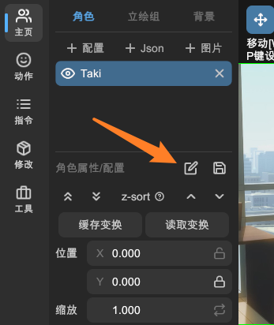
该窗口可以配置立绘的相关信息。

## 角色名

该立绘在 L2DW 中的显示名称。

## 模型路径

Live2D 模型（主立绘）的 Json 文件路径。

> 「主立绘」是在做「拼好模」时才会涉及的概念，在介绍「子立绘」时会有更详细的说明。

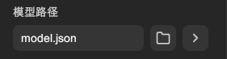

- **文本框**: 编辑与显示模型路径。
- **浏览按钮**: 打开文件选择窗口，选择模型文件。
- **跳转按钮**: 尝试打开模型文件所在的文件夹。

## 立绘指令模板

用于生成 WebGAL 脚本代码的模板。此处填写 `changeFigure` 指令。

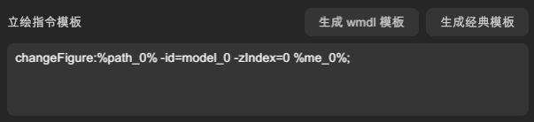

- 文本框: 编辑 `changeFigure` 指令模板，支持换行。
- 生成 wmdl 模板: 一键生成使用 wmdl 文件的立绘指令模板
  - 需要先保存配置文件。
  - 仅建议在 MyGO 3.1.0 及以上使用。
  - 会覆盖当前指令模板。
- 生成经典模板: 一键生成通用的 Live 2D Json 文件的立绘指令模板。
  - 会覆盖当前指令模板。

> 如果您对手写 WebGAL 脚本不熟悉，可以使用「生成模板」按钮生成一个简单的模板，然后根据需要进行修改。

### 作用

当您使用「复制指令 - 表情动作」生成 WebGAL 代码时，L2DW 会将该模板中的占位符替换为实际的参数。

`%path%` 会替换为 WebGAL 立绘目录下模型的文件路径。

`%me%` 会替换为：

- `motion`: Live2D 模型动作。
- `expression`: Live2D 模型表情。
- `bounds`: Live2D 模型拓展边界。
- `transform`: 立绘出场时的变换效果。

例如，假设您在 L2DW 中填写了如下模板:

  changeFigure<!--
  -->:<!--
  -->%path%<!--
  --> -<!--
  -->id<!--
  -->=<!--
  -->myModel<!--
  --> %me%<!--
  -->;

当您执行「复制指令」，L2DW 会将 `%path%` `%me%` 替换为实际的参数。

  changeFigure<!--
  -->:<!--
  -->path/to/model.json<!--
  --> -<!--
  -->id<!--
  -->=<!--
  -->myModel<!--
  --> -<!--
  -->transform<!--
  -->=<!--
  -->{"position":{"x":0,"y":0}}<!--
  --> -<!--
  -->bounds<!--
  -->=<!--
  -->0,0,0,0<!--
  --> -<!--
  -->motion<!--
  -->=<!--
  -->smile<!--
  --> -<!--
  -->expression<!--
  -->=<!--
  -->sad<!--
  -->;

### 子立绘模板

如果您设置了「子立绘」，您需要在指令模板中，书写「主立绘」和「子立绘」代码。[示例模型链接](https://www.bilibili.com/video/BV18FjpzzE7m/)

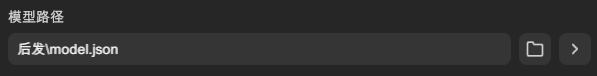
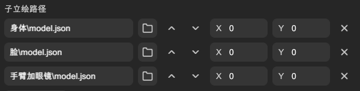
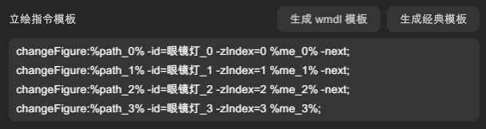

每个模型都有自己的占位符。主立绘使用 `%path%` 或 `%path_0` ，子立绘根据顺序，依次用 `%path_1%` `%path_2%` `%path_3%` ...

`%me` 同理。

### wmdl 文件模板

从 MyGO 3.1.0 开始，MyGO 引擎支持导入 L2DW 的 `.wmdl` 立绘配置文件。

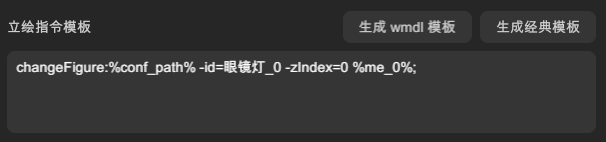

用 `%conf_path%` 占位符可以生成 `wmdl` 文件路径。如果您不想为子立绘书写太多行代码，仅单行的 `wmdl` 指令是一个不错的选择。

## 变换指令模板

用于生成 WebGAL 脚本代码的模板。此处填写 `setTransform` 指令。

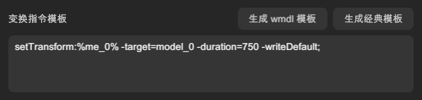

- 文本框: 编辑 `setTransform` 指令模板，支持换行。
- 生成 wmdl 模板: 一键生成使用 wmdl 文件的变换指令模板
  - 需要先保存配置文件。
  - 仅建议在 MyGO 3.1.0 及以上使用。
  - 会覆盖当前指令模板。
- 生成经典模板: 一键生成通用的变换指令模板。
  - 会覆盖当前指令模板。

> 如果您对手写 WebGAL 脚本不熟悉，可以使用「生成模板」按钮生成一个简单的模板，然后根据需要进行修改。

### 作用

当您使用「复制指令 - 变换效果」生成 WebGAL 代码时，L2DW 会将该模板中的占位符 `%me%` 替换为实际的变换效果代码。

例如，假设您在 L2DW 中填写了如下模板:

  setTransform<!--
  -->:<!--
  -->%me%<!--
  --> -<!--
  -->target<!--
  -->=<!--
  -->myModel<!--
  --> -<!--
  -->duration<!--
  -->=<!--
  -->750<!--
  -->;

当您执行「复制指令」，L2DW 会将 `%me%` 替换为实际的代码内容。

  setTransform<!--
  -->:<!--
  -->{"position":{"x":0,"y":0}}<!--
  --> -<!--
  -->target<!--
  -->=<!--
  -->myModel<!--
  --> -<!--
  -->duration<!--
  -->=<!--
  -->750<!--
  -->;

### 子立绘模板

如果您设置了「子立绘」，您需要在指令模板中，书写「主立绘」和「子立绘」代码。[示例模型链接](https://www.bilibili.com/video/BV18FjpzzE7m/)

每个模型都有自己的占位符。主立绘使用 `%me%` 或 `%me_0` ，子立绘根据顺序，依次用 `%me_1%` `%me_2%` `%me_3%` ...

### wmdl 文件模板

从 MyGO 3.1.0 开始，MyGO 引擎支持导入 L2DW 的 `.wmdl` 立绘配置文件。

如果您不想为子立绘书写太多行代码，仅单行的 `wmdl` 指令是一个不错的选择。

## 显示范围

有时 Live2D 模型动作会超出默认的显示范围，您可以使用该参数拓展或收缩显示范围。

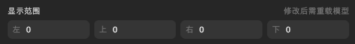

左右的正方向以向右为正方向。例如想要往左边与右边各向外拓展 400 像素，则为 `-400,0,400,0`。

上下的正方向以向下为正方向。例如想要往上边与下边各向外拓展 200 像素，则为 `0,-200,0,200`。

> - 修改该参数后，需要重载模型才能生效。
> - 该参数会影响模型的初始大小和中心点定位。
> - WebGAL 中只有在立绘出场时，该参数才会生效。
> - WebGAL 4.5.14，MyGO 3.0.0，BandoriCraft 1.1.0 修复了关于修改显示范围导致的定位错误问题，L2DW 不会再支持旧版本的错误定位，这可能会导致修改了显示范围后的位置会与旧版本引擎不同。

## 子立绘路径

如果您需要制作「拼好模」，可以在这里添加子立绘。

首先会以「主立绘」（上文的[模型路径](#模型路径)）作为底模，放在最下层。然后依次添加子立绘，子立绘会覆盖在主立绘之上，排位靠下的子立绘会显示在上层。

- **文本框**: 编辑与显示子立绘的模型路径。
- **浏览按钮**: 打开文件选择窗口，选择模型文件。
- **上移按钮**: 将该子立绘上移排序，图层会下移一层。
- **下移按钮**: 将该子立绘下移排序，图层会上移一层。
- **X轴偏移**: 该子立绘相对于主立绘的 X 轴（横向）偏移。
- **Y轴偏移**: 该子立绘相对于主立绘的 Y 轴（纵向）偏移。
- **删除按钮**: 删除该子立绘。

> - 修改该参数后，需要重载模型才能生效。
> - 由于实现问题，子立绘的显示范围取的是主立绘的显示范围，推荐以 WebGAL 中的效果为准。

## 保存与取消

### 保存配置

修改完配置后，点击该按钮以应用修改。

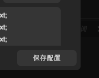

### 关闭窗口

点击右上角的关闭窗口，不会保存您在此窗口所作的修改。

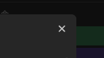

### 保存配置文件

如果想要保存配置文件（`.conf` 或 `.wmdl`），可以点击该按钮，以便下次使用或分享给他人。

---

## 配置图片立绘

图片立绘的配置与 Live2D 立绘类似，有几点区别：

- 没有「子立绘路径」和「显示范围」。
- 不能保存配置文件。
