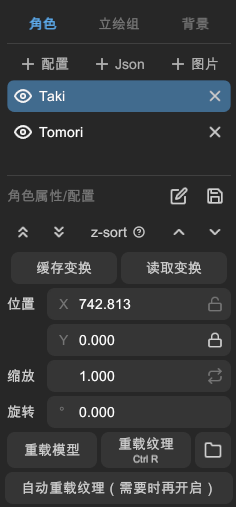

# 操作对象

在「主页」的左侧栏，您可以选中并操作角色、背景和立绘组。

## 对象列表

您可以在列表中，选中要操作的对象。被选中的对象会高亮显示。

- 左侧的眼睛图标用于控制对象的显示与隐藏。
- 右侧的关闭图标用于删除对象。

## z-sort

此属性用于控制对象的图层次序。在列表中越靠上的对象，图层越靠上。

按钮从左到右依次为：

- 「置于最顶层」: 将对象置于所有对象的最顶层
- 「置于最底层」: 将对象置于所有对象的最底层。
- 「上移一层」: 将对象上移一层图层。
- 「下移一层」: 将对象下移一层图层。

> 该属性与 WebGAL 的 z-index 无任何关联。

## 缓存与读取变换

有时我们需要某个对象的位置、旋转、缩放和滤镜，复制到另一个对象上。此时可以使用缓存与读取变换功能。

1. 选中要复制变换的对象，点击「缓存变换」按钮。
2. 选中要粘贴变换的对象，点击「读取变换」按钮。
3. 在弹出的窗口中，选择要复制的变换属性。

## 变换属性

您可以手动输入对象的位置、旋转、缩放。

### 锁定 X Y 轴位置

位置属性右侧的按钮为锁定 X 轴与 Y 轴的位置。

### 水平翻转

缩放属性右侧的按钮为水平翻转按钮。

## 实用功能

### 重载模型

点击该按钮，可以重新加载该对象的模型文件。

### 重载纹理

点击该按钮，可以重新加载该对象的贴图纹理。

### 浏览文件目录

点击该按钮，可以打开该对象的模型文件所在的目录。

### 自动重载纹理

开启时，L2DW 会每隔一段时间自动检测该对象的贴图纹理文件是否被修改，若被修改则自动重载该对象的贴图纹理。
