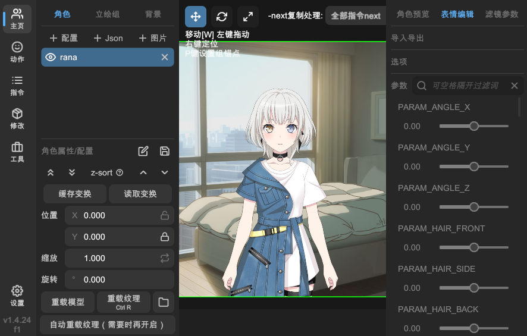
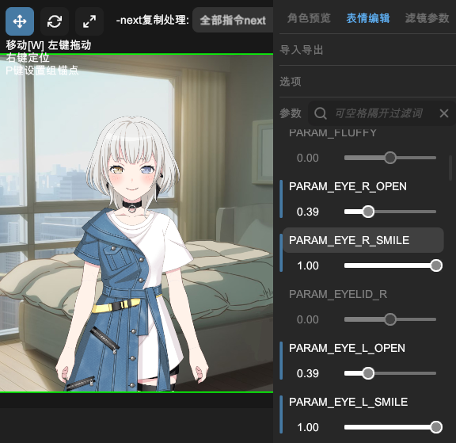
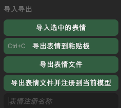

# 自制表情

在「主页」的左侧栏选中 Live2D 立绘，在右侧栏的「表情编辑」页面可以制作表情。

## 设置参数

「参数」面板会显示当前 Live2D 立绘的所有可调节的参数。您可以使用搜索框过滤参数，多个关键字用空格分隔。

### 启用参数

默认所有参数都是锁定状态，无法调节。点击参数名称按钮可以启用该参数。

启用后可以拖动滑动条以调节参数，或者点击输入框手动输入数值。

### 移除参数

如果已解锁参数，再次点击参数名称按钮，该参数将恢复默认值并重新锁定。

## 导入导出

展开「导入导出」面板，显示相关选项。

### 导入选中的表情

在「角色预览」页面，选中已有的表情后，可以点击「导入选中的表情」按钮，导入选中的表情。

### 导出表情到粘贴板

根据已设置的参数，生成表情内容，并复制到系统粘贴板。

### 导出表情文件

根据已设置的参数，生成表情内容，并保存为 `.exp.json` 文件。

### 导出表情文件并注册到当前模型

根据已设置的参数，生成表情内容，保存为 `.exp.json` 文件，并自动注册到当前 Live2D 立绘模型中。

> 注册后，需要重载模型才能在「角色预览」页面看到新表情。

### 表情注册名称

该表情注册到模型时使用的名称。若不填写，则使用表情文件名作为注册名称。

## 选项

展开「选项」面板，显示相关选项。

### 只显示选中参数

启用后，「参数」面板只显示已启用的参数。

### 锁定参数启用状态

启用后，点击参数名称按钮不会改变参数的启用状态。此选项有助于避免误操作。
