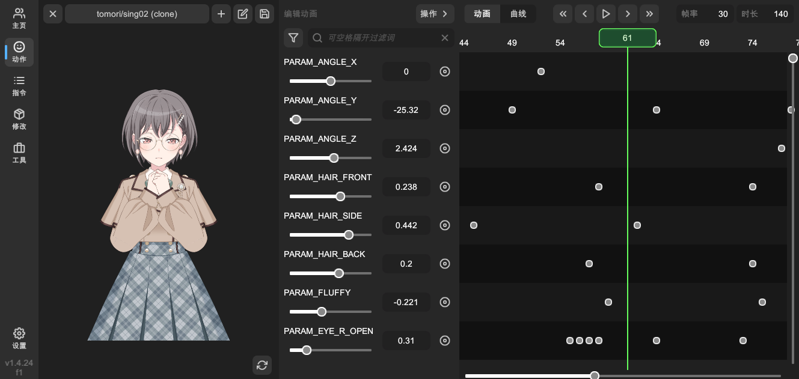
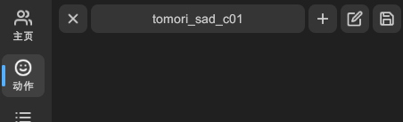
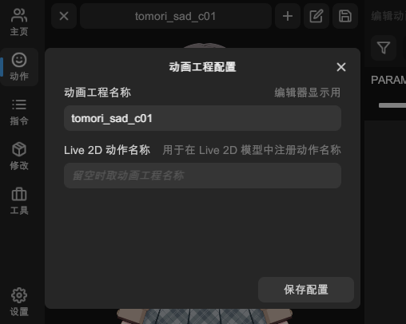
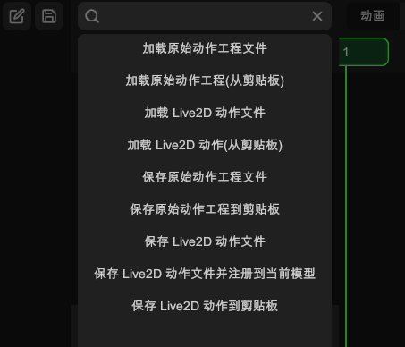
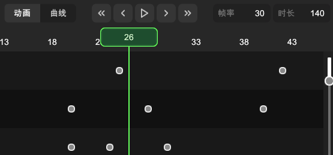
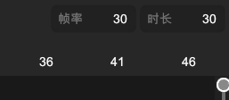
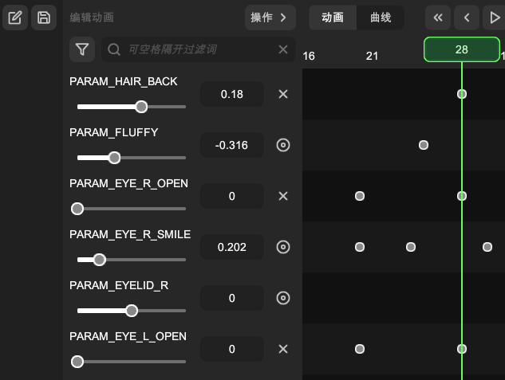
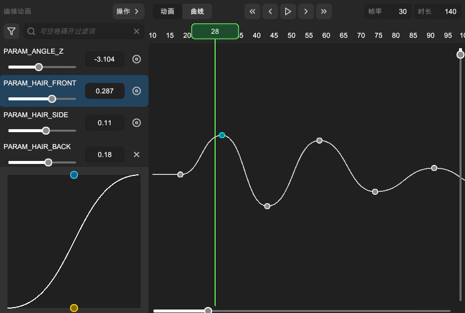
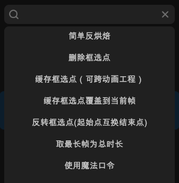

# 自制动作

点击左侧的「动作」按钮，即可切换至动作编辑界面。

> 本章节假设用户有在其他软件制作过关键帧动画的经验。

## 控制镜头

在左侧的预览区域内，您可以通过鼠标控制镜头的位置和缩放。

### 平移镜头

鼠标在预览区域内（非 UI 区域），按住鼠标左键以拖动视角。

### 缩放镜头

鼠标在预览区域内（非 UI 区域），滚动鼠标滚轮以缩放视角。

### 重置镜头

点击预览区域右下角的「重置镜头」按钮，可以将镜头位置和缩放重置为默认状态。

## 动作工程

预览区域的上方可以配置动作工程相关选项。

按钮从左到右依次为：

### 删除动作工程

删除当前动作工程。

### 切换动作工程

如果您已经创建多个动作工程，可以点击该按钮切换当前编辑的动作工程。

### 新建动作工程

新建一个动作工程。您也可以从已有的动作中克隆出一份新的动作工程。

### 配置动作工程

打开动作工程编辑面板，您可以修改动作工程的更多属性。

- **动画工程名称**：当前动作工程的名称。
- **Live 2D 动作名称**：注册到模型时使用的动作名称，如果留空，则使用动画工程名称。

> 配置完毕后，点击「保存配置」按钮以保存修改。如果直接关闭窗口，则不会保存修改。

### 加载或保存动作

保存当前动作工程。

- **加载原始动作工程文件**：加载 `.wmot` L2DW 专用动作工程文件。
- **加载原始动作工程（从剪贴板）**：从剪贴板加载 L2DW 专用动作工程文件。
- **加载 Live2D 动作文件**：加载 `.mtn` Live2D 动作文件。
- **加载 Live2D 动作文件（从剪贴板）**：从剪贴板加载 Live2D 动作文件。
- **保存原始动作工程文件**：将当前动作工程保存为 `.wmot` 文件。
- **保存原始动作工程到剪贴板**：将当前动作工程保存到系统剪贴板。
- **保存 Live2D 动作文件**：将当前动作工程保存为 `.mtn` 文件。
- **保存 Live2D 动作文件并注册到当前模型**：将当前动作工程保存为 `.mtn` 文件，并注册到当前 Live2D 模型。
- **保存 Live2D 动作文件到剪贴板**：将当前动作工程保存到系统剪贴板。

> 有关原始动作工程与 Live2D 动作文件格式的详细说明，请参见文件格式的 [wmot](file-format.md#wmot) 和 [mtn](file-format.md#mtn)。

## 播放动作

在右侧编辑区域的上方，可以控制动作的播放。

图中显眼的绿色 UI 组件是播放头，它的位置决定着动画播放的位置。您可以在时间刻度区域，按住鼠标左键拖动播放头。

顶部居中的按钮从左到右依次为：

- **跳转至起始帧**：将播放头跳转至动作的起始帧。
- **后退一帧**：将播放头后退一帧。
- **播放/暂停**：播放或暂停当前动作。
- **前进一帧**：将播放头前进一帧。
- **跳转至结束帧**：将播放头跳转至动作的结束帧。

- **帧率**：设置当前动作的帧率。默认值为 30 帧每秒。
- **时长**：设置当前动作的总时长，单位为帧。

## 编辑关键帧

每个参数都拥有一条轨道，每条轨道上包含该参数的所有关键帧。

提示:

- 您可以用搜索框过滤参数，多个关键字用空格分隔。
- 点击搜索框左侧的过滤按钮，隐藏没有关键帧的参数轨道。
- 鼠标悬浮在参数列表上，使用鼠标滚轮是垂直滚动。
- 鼠标悬浮在轨道区域，使用鼠标滚轮是水平滚动。
- 鼠标悬浮在轨道区域，按住 Ctrl 键使用鼠标滚轮是水平缩放。

### 添加关键帧

移动播放头到没有关键帧的位置

- 点击参数列表右边的小按钮，手动添加关键帧。
- 调节参数值，自动添加关键帧。

### 删除关键帧

- 移动播放头到已有关键帧的位置，点击参数列表右边的小按钮，手动删除关键帧。
- 在轨道上框选关键帧，按下键盘的 Delete 键删除关键帧。

### 调节关键帧值

移动播放头到已有关键帧的位置，在参数列表里调节参数值。

- 拖动滑动条。
- 点击输入框手动输入数值。

### 移动关键帧

在轨道上框选关键帧，按住鼠标左键拖动关键帧到新的位置。

> 注意，如果移动的目标位置已有关键帧，则会覆盖掉目标位置的关键帧。

### 复制粘贴关键帧

在轨道上框选关键帧，使用键盘快捷键 Ctrl C 复制关键帧，Ctrl V 粘贴关键帧到播放头所在位置。

## 编辑曲线

点击上方的「曲线」按钮，可以切换至曲线编辑模式。

### 选择轨道

由于一次只能显示一条轨道的曲线，您需要先在左侧的参数列表中选择一个参数轨道，才能编辑该轨道的曲线。

### 调节控制点

点击曲线上的关键帧，参数列表下方会显示该关键帧的控制点。拖动控制点可以调节曲线的形状。

## 操作菜单

点击上方的「操作」按钮，可以打开操作菜单，执行更多操作。

### 简单反烘焙

`mtn` 动作文件的关键帧时每帧存储的，缺少曲线信息。此命令用一种简单的方法将简化的关键帧，还原为曲线。

### 删除框选点

删除框选的关键帧。

### 缓存框选点（可跨动作工程）

复制框选的关键帧。

### 缓存框选点覆盖到当前帧

将复制的关键帧覆盖到当前播放头所在的帧位置。

### 反转框选点（起始点互换结束点）

将框选的关键帧顺序反转。

### 取最长帧为总时长

取所有轨道上关键帧的最长帧数，设置为当前动作的总时长。

### 使用魔法口令

打开一个窗口，输入命令以执行一些尚未有图形界面的功能。
