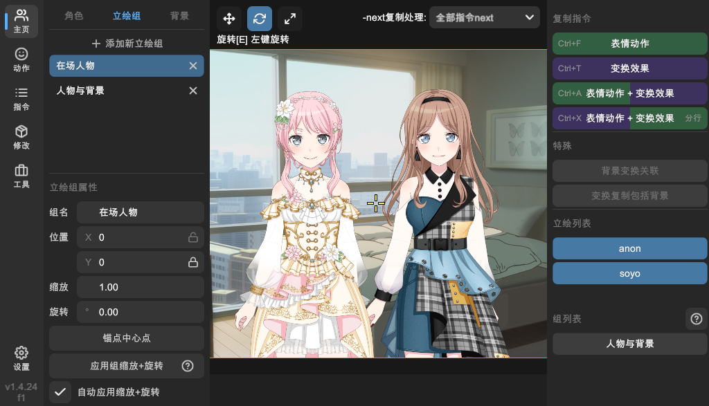

# 立绘组

有时我们想同时移动旋转缩放多个立绘，甚至包括背景，这时可以使用立绘组功能。

立绘组的概念类似于「选择集」，没有严格的从属关系。一个立绘可以同时存在于多个立绘组中。

## 创建与删除

在「主页」的左侧栏的「立绘组」页面，点击「添加新立绘组」即可创建。点击对应立绘组右侧的「删除」按钮即可删除。

## 加入与退出

选中一个立绘组，在右侧栏的「立绘列表」里选择要加入该组的立绘，取消选择即可退出组。

## 编辑属性

选中对应的立绘组，在左侧栏可以编辑该组的属性。包括：

- 组名
- 变换（位置、旋转、缩放）

## 实用工具

- 锚点中心点：重新设置该立绘组的锚点，使其居中。
- 应用组缩放 + 旋转：若未勾选自动应用缩放 + 旋转，可以点击此按钮手动应用。
- 自动应用缩放 + 旋转：勾选后，手动输入立绘组的缩放与旋转的数值会被立即应用，应用后数值自动重置。

> 由于立绘组实际上是「选择集」，缩放和旋转属性实际上是不存在的，因此在输入数值后会立即应用到组内的立绘上。

## 复制指令

在右侧栏的「复制指令」面板中，点击复制按钮，可以对组内的所有立绘生成 WebGAL 代码。具体每个按钮的作用可参考[生成 WebGAL 代码](generate-code.md)。

## 其他选项

在右侧栏的「特殊」面板中，可以设置：

- 背景变换关联：选中后，背景也会加入该组。
- 变换复制包括背景：选中后，生成代码时会包括背景。
