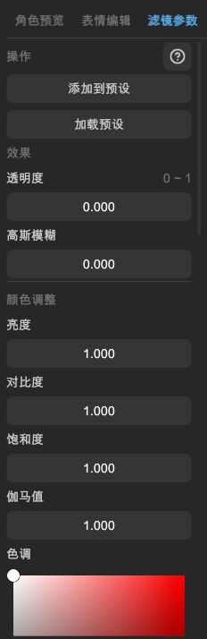

# 滤镜

在「主页」的左侧栏，选中角色或背景，在右侧栏的「滤镜参数」页面中调整滤镜效果。

## 滤镜参数

滤镜参数具体含义请参考[WebGAL 文档 - 变换效果参考](https://docs.openwebgal.com/script-reference/others/transform-reference.html)。

### 提示

- 在数值输入框，点击左键以手动输入数值。
- 在数值输入框，长按右键滑动可连续调整数值。
- 点击拾色器的 RGB、HSV 或编辑按钮，可以手动输入颜色数值。

### 注意

- 由于实现上的差别，L2DW 中的滤镜效果与 WebGAL 中可能存在细微差别，请以 WebGAL 里的效果为准。
- 不推荐同时使用「模糊」和「泛光滤镜的模糊」，这可能会导致性能问题。
- 在 WebGAL 4.5.13、BandoriCraft 1.1、MyGO 2.5 及以下版本，倒角不支持软化参数，并且颜色混合有区别，需要在 L2DW 开启「旧版倒角效果」才能保持视觉效果一致。
- 暂不支持电影滤镜。

## 滤镜预设

如果您想快速应用某种滤镜效果，或者保存当前的滤镜设置以便以后使用，可以使用预设功能。

滤镜预设保存在软件目录下的 `FilterSetPreset.json` 中，在软件重启后不会丢失。您也可以将其分享给他人，或者升级软件时迁移已有预设。

### 添加到预设

将当前滤镜参数保存为预设。您可以为当前预设命名。

### 加载预设

从预设列表中，选择一个预设并应用其滤镜参数。
