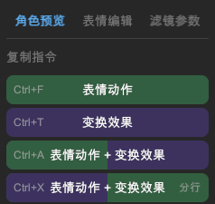
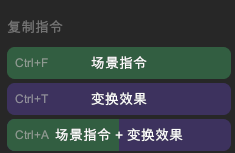
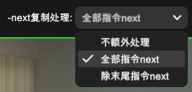

# 生成 WebGAL 代码

在 L2DW 中摆放好立绘与背景位置，选择完 Live2D 模型的动作与表情后，调整完滤镜后，即可生成对应的 WebGAL 代码。

## 立绘

选中立绘后，您可以在右侧栏的「角色预览」中，看到「复制指令」相关按钮按钮，点击后即可将生成的代码复制到剪贴板中。

### 表情动作

生成 `changeFigure` 语句，将模板里的 `%me%` 替换为：

- `motion`: 选择的动作名称。
- `expression`: 选择的表情名称。

### 变换效果

生成 `setTransform` 语句，将模板里的 `%me%` 替换为变换参数，包括：

- 变换（位置、旋转、缩放）。
- 滤镜。

### 表情动作 + 变换效果

> 推荐在立绘第一次出场时使用。

生成 `changeFigure` 语句，将模板里的 `%me%` 替换为：

- `motion`: 选择的动作名称。
- `expression`: 选择的表情名称。
- `transform`: 变换参数，包括:
  - 变换（位置、旋转、缩放）。
  - 滤镜。
- `bounds`: Live2D 模型的显示边界框。

### 表情动作 + 变换效果（分行）

一行写 `changeFigure`，接着一行写 `setTransform`。相当于「表情动作」与「变换效果」二合一。

## 背景

选中背景后，您可以在右侧栏看到「复制指令」相关按钮按钮，点击后即可将生成的代码复制到剪贴板中。

### 切换背景

生成 `changeBg` 语句，将模板里的 `%me%` 替换为背景文件路径。

### 变换效果

生成 `setTransform` 语句，将模板里的 `%me%` 替换为变换参数，包括：

- 变换（位置、旋转、缩放）。
- 滤镜。

### 切换背景 + 变换效果

生成 `changeBg` 语句，将模板里的 `%me%` 替换为：

- 背景文件路径。
- `transform`: 变换参数，包括:
  - 变换（位置、旋转、缩放）。
  - 滤镜。

## next 复制处理

有时候我们想批量的给语句加上 `-next` 参数，除了修改模板外，也可以更改此选项来快速修改。

### 不额外处理

原原本本地按照模板生成代码。

### 全部指令 next

为生成的每一行代码都添加 `-next` 参数。

### 除末尾指令 next

为生成的每一行代码都添加 `-next` 参数，唯独最后一行不处理。
