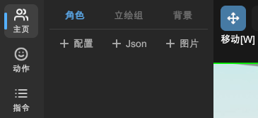

# 导入立绘

在「主页」的「角色」页面，您可以看到有三个导入按钮。目前您可以导入以下三种格式的立绘：

选择文件并导入后，L2DW 会将立绘添加到当前场景中，并显示在「角色」列表里。

> 推荐加载您的 WebGAL 游戏的 `figure` 目录下的立绘，这样 L2DW 会正确计算模型的相对路径。

!> 强烈推荐在导入 Live2D 立绘前，先配置「[设置 - 实验性 - Live 2D 定位模式](settings.md#live-2d-定位模式)」。

## 配置

L2DW 专用的立绘配置文件（`.conf` `.wmdl`格式），可以储存更多信息。详情请见[文件格式 - conf 和 wmdl](file-format.md#conf-和-wmdl)。

## Json

Live2D 的立绘描述文件（`.json`格式）。

## 图片

纯图片形式的立绘（`.png` `.jpg`格式）。
