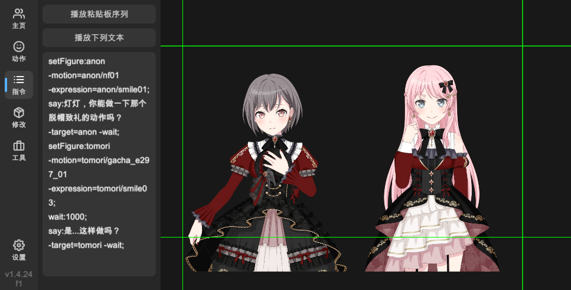
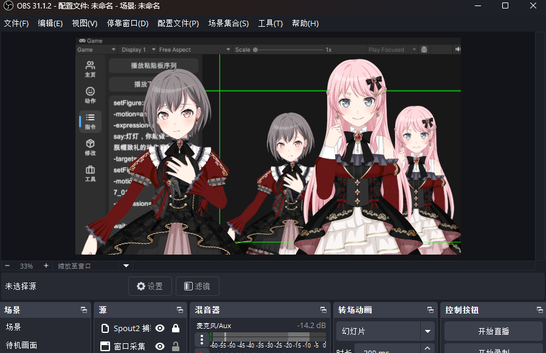

# 播放指令

点击左侧的「指令」按钮，即可切换至播放指令界面。

您可以将此界面当作一个简化的 WebGAL 播放器，您可以输入一行行指令，切换 Live2D 模型的动作与表情，张嘴说话等。

配合[输出舞台画面](settings.md#输出舞台画面)功能，您可以录制一些视频以便后期使用。

> 输出的画面是实时的，透明底的（需要隐藏背景图片）。

## 语法

播放指令的语法模仿了 WebGAL 的脚本语法，都是四段式指令：

  命令类型<!--
  -->:<!--
  -->主要内容<!--
  --> -<!--
  -->参数名1<!--
  -->=<!--
  -->参数值1<!--
  --> -<!--
  -->参数名2<!--
  -->=<!--
  -->参数值2<!--
  -->; 行内注释

  setFigure<!--
  -->:<!--
  -->anon<!--
  --> -<!--
  -->motion<!--
  -->=<!--
  -->anon/nf01<!--
  --> -<!--
  -->expression<!--
  -->=<!--
  -->anon/smile01<!--
  -->;

> 需要注意的是，默认情况下，每条指令都不会等待，类似每个指令都会有一个隐形的「-next」参数。
如果需要执行完指令后等待一段时间，请使用 `wait` 命令。

## 脚本参考

### say

让指定的 Live2D 立绘说话。

  say<!--
  -->:<!--
  -->随便说几句<!--
  --> -<!--
  -->target<!--
  -->=<!--
  -->anon<!--
  --> -<!--
  -->wait<!--
  -->;

- **target**
  
  指定说话的 Live2D 角色名称。

- **wait**

  根据说话内容自动计算说话时间，等待说话结束后再执行下一条指令。如果您对自动生成的等待时间不满意，可以使用 `wait` 命令自定义等待时间。

### wait

等待指定的时间（以毫秒为单位）。

  
    say<!--
    -->:<!--
    -->随便说几句<!--
    --> -<!--
    -->target<!--
    -->=<!--
    -->anon<!--
    -->;
  
  
    wait<!--
    -->:<!--
    -->2500<!--
    -->;
  

### shutup

让指定的 Live2D 立绘停止说话。

如果 say 指令不使用 -wait 参数，而是用 wait 指令等待，原来的 say 指令仍然会按照自动生成的时长驱动立绘张嘴。

如果您设置的 wait 指令时长远小于 say 自动生成的张嘴时间，此时您需要手动使用 shutup 指令停止立绘说话。

  
    say<!--
    -->:<!--
    -->随便说几句<!--
    --> -<!--
    -->target<!--
    -->=<!--
    -->anon<!--
    -->;
  
  
    wait<!--
    -->:<!--
    -->500<!--
    -->;
  
  
    shutup<!--
    -->:<!--
    --> -<!--
    -->target<!--
    -->=<!--
    -->anon<!--
    -->;
  

- **target**
  
  指定闭嘴的 Live2D 角色名称。

### setFigure

设置指定 Live2D 立绘的动作与表情。

语句内容填写 Live2D 立绘的名称。

  setFigure<!--
  -->:<!--
  -->anon<!--
  --> -<!--
  -->motion<!--
  -->=<!--
  -->anon/nf01<!--
  --> -<!--
  -->expression<!--
  -->=<!--
  -->anon/smile01<!--
  -->;

- **motion**
  
  指定 Live2D 立绘的动作名称。

- **expression**

  指定 Live2D 立绘的表情名称。
