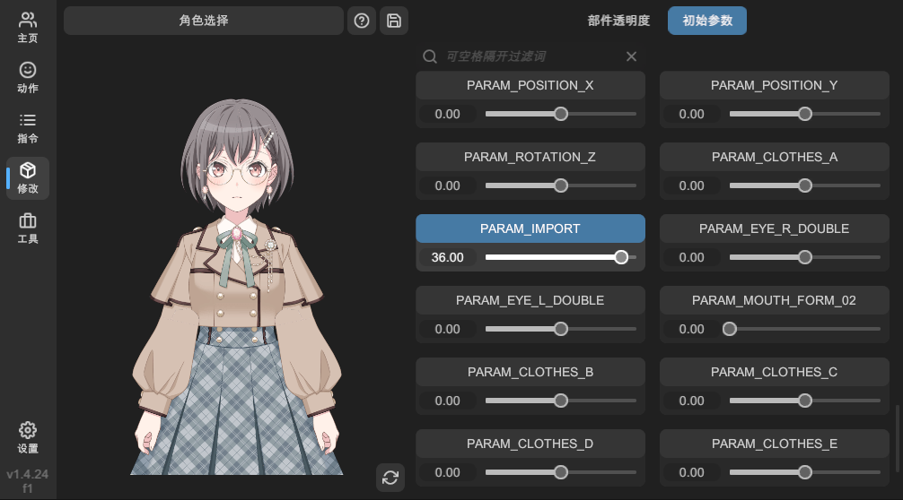

# 修改 Live 2D

!> 在修改 Live 2D 文件前，推荐做好文件备份。

点击左侧的「修改」按钮，即可切换至修改 Live 2D 界面。

此界面帮助您快速修改 Live 2D Json 文件中的一些配置项。

## 部件透明度

调整这里的参数，修改 Live 2D 部件的初始不透明度。

### 启用参数

可以使用一下两种方法启用参数。

- 点击参数名称，使其高亮。
- 修改参数值会自动启用参数。

### 修改参数

拖动滑动条以修改参数。

### 移除参数

再次点击高亮的参数名称，即可移除参数。

## 初始参数

调整这里的参数，修改 Live 2D 的初始参数。

### 启用参数

可以使用一下两种方法启用参数：

- 点击参数名称，使其高亮。
- 修改参数值会自动启用参数。

### 修改参数

可以使用一下两种方法修改参数：

- 拖动滑动条。
- 点击输入框，手动输入数值。

### 移除参数

再次点击高亮的参数名称，即可移除参数。

## 保存修改

> 虽然调整参数后，L2DW 可以看到应用后的效果，但是需要真正将参数写入 Live2D Json 文件，配置项才可以被 Live 2D 真正使用。

点击预览区域右上角的「保存」按钮，可以将当前配置项写入当前 Live2D Json 文件。

### 复制属性到剪贴板

将修改后的属性复制到系统剪贴板。

### 复制主模型 json 到剪贴板

将修改后的主模型 Json 文件内容复制到系统剪贴板。

### 保存到主模型 json 中

将修改后的属性写入当前 Live2D 主模型 Json 文件。

### 保存到所有模型 json 中

将修改后的属性写入当前 Live2D 立绘组中的所有模型 Json 文件，包括主立绘和子立绘。
