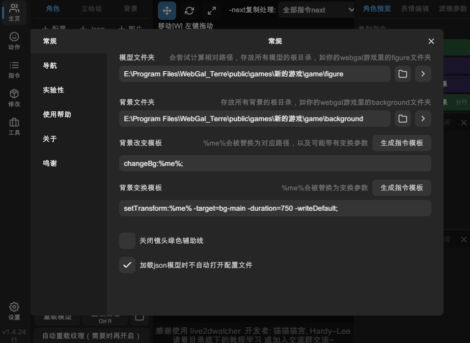

# 设置

此页面介绍设置窗口的选项。若没有特殊说明，选项一旦更改后会自动应用。

## 常规

### 模型文件夹

通常选择您的游戏目录下的 `figure` 文件夹。例如：

`WebGAL_Terre在您设备上的安装目录\public\games\你的游戏名称\game\figure`

如果您加载的立绘来自这个文件夹下，L2DW 会正确计算模型的相对路径，从而保证生成的代码可以在 WebGAL 中正常使用。

### 背景文件夹

通常选择您的游戏目录下的 `background` 文件夹。例如：

`WebGAL_Terre在您设备上的安装目录\public\games\你的游戏名称\game\background`

如果您加载的背景来自这个文件夹下，L2DW 会正确计算背景的相对路径，从而保证生成的代码可以在 WebGAL 中正常使用。

### 背景改变模板

用于生成 WebGAL 脚本代码的模板。此处填写 `changeBg` 指令。

当您执行 「复制指令 - 改变背景」时，`%me%` 会替换为背景的文件路径和 `transform` 参数。

### 背景变换模板

用于生成 WebGAL 脚本代码的模板。此处填写 `setTransform` 指令。

当您执行 「复制指令 - 变换效果」时，`%me%` 会替换为实际的代码内容。

### 关闭镜头绿色辅助线

勾选后，场景将隐藏表示舞台范围的绿色辅助线。

### 加载 json 模型时不自动打开配置文件

勾选后，加载 Live2D json 模型时不会自动打开角色配置窗口。

## 导航

### 镜头缩放系数

用鼠标滚轮缩放镜头时的缩放系数。数值越大，缩放越快。

> - 数字必须大于 1，否则可能会有奇怪的问题。
> - 推荐一点一点地调节该数值，如 1.1、1.2 等。

### 镜头缩放系数(按住 Ctrl)

按住 Ctrl 时，用鼠标滚轮缩放镜头时的缩放系数。数值越大，缩放越快。

> - 数字必须大于 1，否则可能会有奇怪的问题。
> - 推荐一点一点地调节该数值，如 1.1、1.2 等。

## 实验性

### 允许立绘眨眼

勾选后，会尝试驱动 Live2D 立绘眨眼。

### WebGAL 旧版表情解析特性支持

勾选后，L2DW 会尝试模仿旧版本 WebGAL 对表情的解析方式。如果您发现 L2DW 中的表情与旧版本 WebGAL 中不一致，可以尝试开关此选项。

### Live 2D 定位模式

由于不同引擎，不同版本的 WebGAL 对 Live2D 模型的定位方式不同，您可以根据需要选择合适的定位模式。

- **4.5.12**: 适用于 WebGAL 4.5.12 及更早版本，或 MyGO 2.3 及更早版本。
- **4.5.13**: 适用于 WebGAL 4.5.13 及更高版本，或 MyGO 2.4 ~ 2.5。
- **BC 1.0**： 适用于 BandoriCraft 1.0 及更高版本，或 MyGO 3.0.0 及更高版本。

> 切换后，需要重载场上所有模型才能生效。建议在一开始就设置好此选项，以免出现定位偏差。

### 启用自定义游戏分辨率

如果您的引擎支持自定义游戏分辨率，您可以勾选此选项，以便正确定位立绘和背景。

> 修改分辨率后，您需要重启 L2DW 才能生效。推荐在一开始就设置好此选项。

### 输出舞台画面

L2DW 使用 Spout 技术，将透明底的舞台画面输出到其他支持 Spout 的软件中。

如果您使用的 OBS 或 Shoost 也安装了 Spout 插件，您应该可以接收到 L2DW 实时传输的画面。

修改输出分辨率后，您需要重新打开「输出舞台画面」
