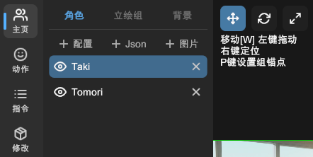

# 移动、旋转、缩放

首先在「主页」的左侧栏中，选中要操作的立绘或背景。

您可以通过点击上方的按钮，在移动、旋转、缩放模式之间切换。

## 移动

在移动模式（快捷键 `W`）下，在场景区域内（非 UI 区域）：

- 按住鼠标左键拖动。
- 点击鼠标右键直接设置位置。
- 使用立绘组时，点击 `P` 键设置中心点位置。

## 旋转

在旋转模式（快捷键 `E`）下，在场景区域内（非 UI 区域）：

- 按住鼠标左键拖动，对象将绕中心点旋转。

## 缩放

在缩放模式（快捷键 `R`）下，在场景区域内（非 UI 区域）：

- 按住鼠标左键拖动，对象将按中心点缩放。
